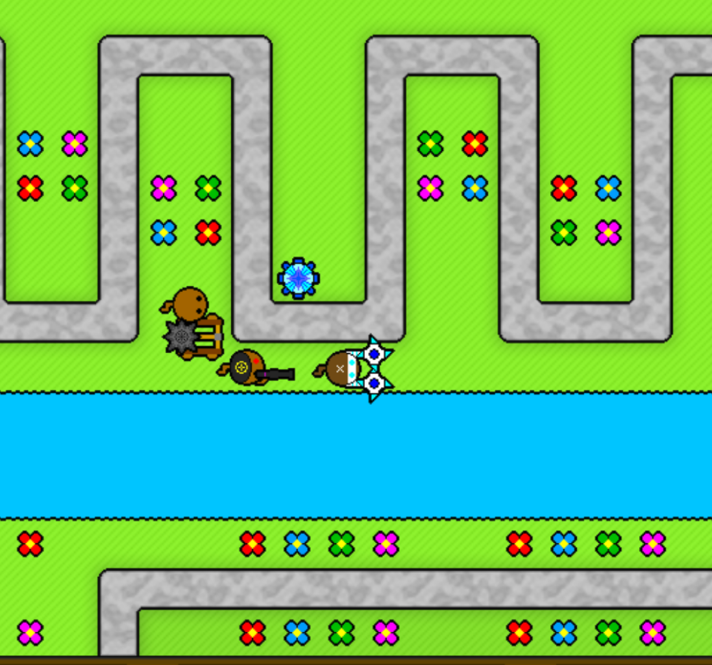

# bloons tower defense x: go

this is a ground-up engine rewrite of the fan game "bloons tower defense x" (originally made by ramaf party). i rewrote it in go using ebitengine so it actually runs nice and smooth on modern setups.

all the game logic, towers, paths, and bloons were coded from scratch, and all the original assets are bundled inside the repo so you don't have to manually extract anything yourself.

## how to play




### download

if you just wanna play, you don't need to mess with the code. hit up the **[Releases](https://github.com/FlavouredTux/bloons-tower-defense-x-go/releases)** tab on the right side of the github page and grab the zip file. extract the folder and just run the game.

### build from source

if you want to mess with the code or build it from scratch, you just need [go](https://go.dev/) installed. clone the repo and do:

```bash
make run
```

to build the executable to play offline later:

```bash
make build
```

you can also easily cross-compile for windows if you're on linux/mac:
```bash
GOOS=windows GOARCH=amd64 go build -o btdx.exe ./cmd/btdx
```

## what's inside

the game is in a *playable* state right now, but it's nowhere near done. here's what actually works so far:
- the core btd gameplay loop (90 waves, all speed modes, auto-start)
- all 24 towers with their upgrade chains, tier 4/5 paths, and abilities
- full bloon wave timelines and path spawning across 30+ tracks
- main menus, track selection, difficulty modes, and modifier flags
- **bounty center** — boss bloon fights across 4 difficulty tiers with save progress
- **boss fights** — 6 boss types (Bully, Mother, Clown, LUL, Blooming, Crawler) each with their own rooms and wave configs
- **career save system** — rank, XP, monkey money, bounty progress, and track milestones saved to disk
- **credits screen**
- made with just plain go and ebitengine

more towers and features will get added over time.

## credits

- original project, art, sounds, and game design by ramaf party.
- port and rewrite using ebitengine.
