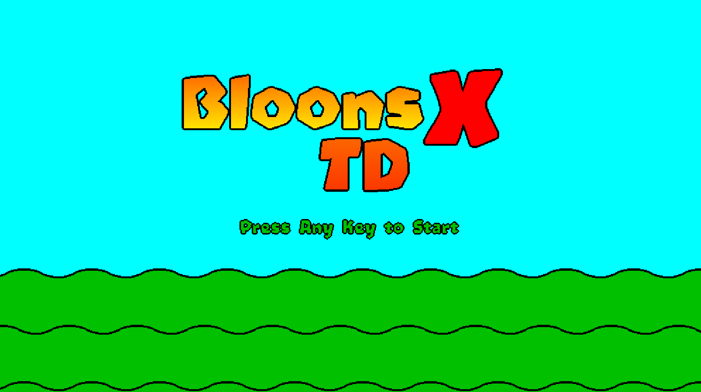

# bloons tower defense x (go port)

this is a modern engine rewrite of the fan game "bloons tower defense x" (originally made by ramaf party). i ported it to go using ebitengine so it runs smoothly on modern hardware.

all the game logic, towers, paths, and bloon mechanics have been rewritten in go, and all the game assets are included in this repo so you don't need to manually extract anything.

## how to play

<p align="center">
  
  
</p>

### download

you don't need to compile anything if you just want to play. go to the **[Releases](https://github.com/FlavouredTux/btdx-go/releases)** tab on the right side of the github page and download the latest zip file for your OS. unzip it, and run the executable!

### build from source

if you want to modify the code or build it yourself, you just need to have [go](https://go.dev/) installed. clone the repo and run:

```bash
make run
```

to build the executable to play offline later:

```bash
make build
```

you can also easily build for windows from linux/mac:
```bash
GOOS=windows GOARCH=amd64 go build -o btdx.exe ./cmd/btdx
```

## what's inside

the game is in a *playable* state right now, but it's nowhere near done. here's what works:
- fully functioning core btd gameplay loop
- the first few base towers and their max tier upgrades (dart monkey, ninja, etc.)
- full bloon wave timeline and spawning system 
- main menus, settings, track select, etc.
- strictly built entirely with ebitengine and normal go packages

more towers and features will be implemented over time.

## credits

- original project, art, sounds, and design by ramaf party.
- ported to go with ebitengine.
